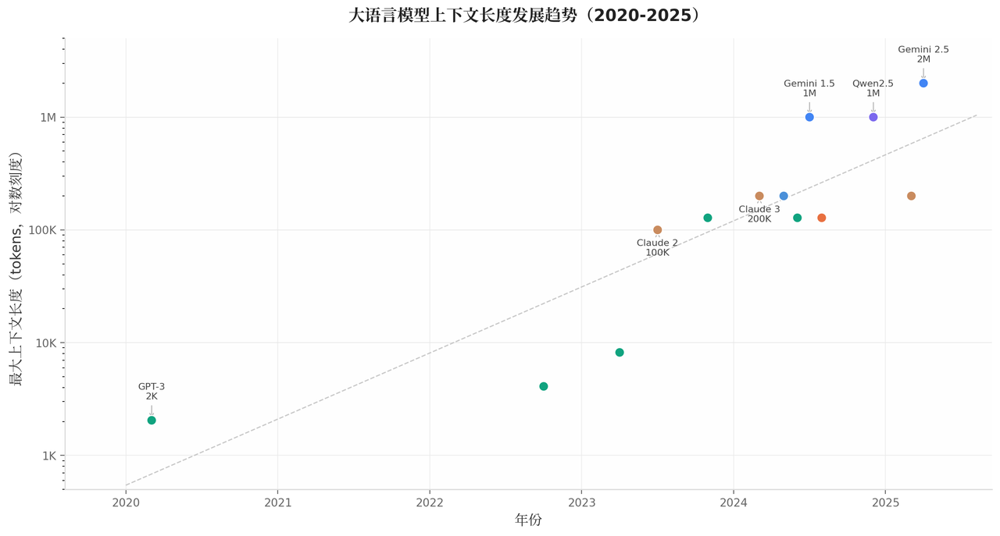
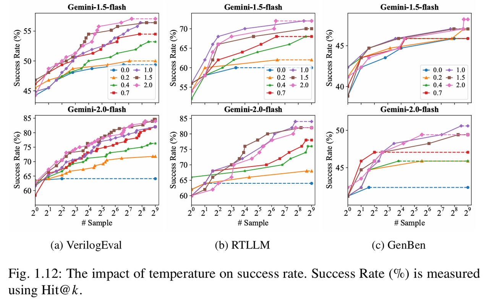
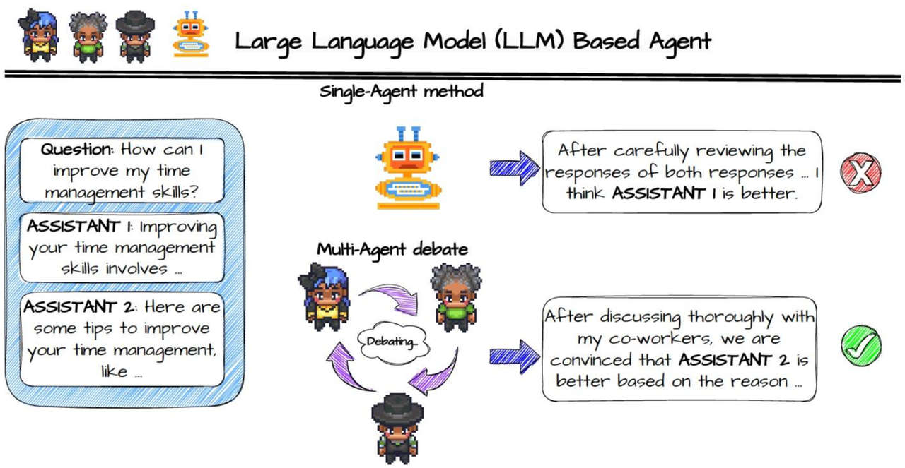
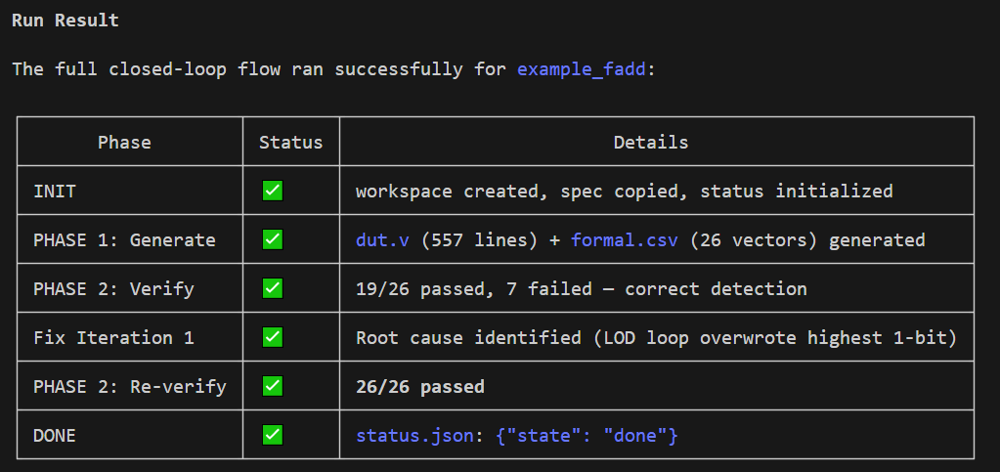

## Subagent in Claude Code & MultiAgent System
我们为什么要设计多智能体？

### 出发点一：Context有效性

尽管LLM支持的上下文长度在不断增长（2K->2M），但有效提示词的长度总是越短越好；
- 直觉上，提示词越多，模型能够做出正确理解/预测的概率就越低
- 数学上，Softmax的归一化特性导致长序列中注意力概率质量被稀释：信息熵增加，信噪比下降
$$\text{softmax}(\mathbf{x}) = \frac{1}{\sum_{j=1}^{n} e^{x_j}} \begin{bmatrix} e^{x_1} \\ e^{x_2} \\ \vdots \\ e^{x_n} \end{bmatrix}$$

-> 流水线式分工的智能体工作流：通过分工协作，尽量缩短每个子任务有效提示词的长度，提高整体任务表现


### 出发点二：LLM-Monkeys
由于LLM输出本质上是随机采样，Agentic的工作流程都需要严格的验证器来保证正确；
Multi-Agent提供了Agent-level并行的可能性，增加“验证器导向”的试错成功效率
![[Brown B, Juravsky J, Ehrlich R, et al. Large language monkeys: Scaling inference compute with repeated sampling[J]. arXiv preprint arXiv:2407.21787, 2024.]](./figs/2.PNG)

![[Niu, Juxin, et al. "VerilogMonkey: Exploring Parallel Scaling for Automated Verilog Code Generation with LLMs." arXiv preprint arXiv:2509.16246 (2025).] ](./figs/3.PNG)




### 出发点三：MAD：三个臭皮匠顶个诸葛亮
和LLM Monkey不同的是，尽管Agents处理的是同一个问题，MAD更侧重Agents之间的通讯（Communication）
Debate能够一定程度上减少模型幻觉，就像长思维链；



但事实是，Deepseek-R1为代表的单模型长思维链的做法逐渐取代MAD方法，单模型输出长思维链往往有着更高的信息密度，更少的token开销；
现在的MAD更多地认为不同模型（Diversity）之间的Debate更有价值


### claude code的Subagent用法以及自动化工作流的构建
#### Subagent的创建
- 方法一：通过claude code中的/agents创建：
  - 手动输入参数：1 子agent的系统提示词 2 子agent的使用条件（when to use）
  - 通过claude code自动创建：输入一段描述，claude code理解之然后自主创建

- 方法二：手动编写.claude/agents/xx.md，但需要注意：
  - 必须包含yaml元数据头，并且name和md文件名一致
  - 重启claude code

#### 自动化工作流的构建
以一个简单的Spec2RTL Presim的demo为例：

```markdown
帮我生成一个 模块设计需求 到 RTL代码的智能体框架
包含顶层的控制流程（./claude/CLAUDE.md）和 子agents：
* rtl-generator: 根据spec生成rtl代码 dut.v
* formal-verifier：生成python-level正确的输入输出映射csv文件，即出硬件模块正确的输入输出test-plan，例如对于一个浮点加法模块，列出正确的输入输出映射表，需考虑各种corner case
* rtl-verifier：根据csv文件和rtl代码写 testbench.v, 运行iverilog反馈错误信息

agent之间通过文件沟通协作，例如 dut.v / formal.csv / dut_test.v / error.log 等
更重要的是通过顶层的CLAUDE.md管理整个 生成代码 -- 生成测试 -- 仿真报错 -- 修改代码 的整个循环流程

帮我在这个文件夹下设计整个工作环境，先理清一版工作流程，做好文件目录管理，建议隔开每个子agent的工作目录，然后先试着写出三个子agent的系统提示词（包括正确的脚本调用细节）和CLAUDE.md初版

当前bash环境已经装好iverilog，可以直接脚本调用

---

整个框架已经初步搭好：
* 整个设计--验证的循环流程已经写好在.claude/CLAUDE.md中
* 所有subagent的系统提示词都在.claude/agents/中

先尝试按照CLAUDE.md的流程运行projects/example_fadd下的设计任务，检查流程中不合理的地方，优化上述提示词，优化整个框架；
注意如果这里的运行成功指的并非是成功生成符合spec要求的rtl代码，而是整个框架能够正确平滑地运行起来
have a try！
```

#### 运行结果：
1h18m 
经过两轮的设计--验证agents的调用，完成spec中fp32加法器的RTL和功能的验证，验证的case在formal.csv中


并汇报已经修改的流程问题：

```markdown
  Three Issues Fixed
1. Parallel execution clarity (CLAUDE.md): Added CRITICAL note that both agents MUST be launched in a single message for true parallelism. The dry run launched them sequentially, which wastes time.
2. Fix mode over-claiming (agents/rtl-generator.md): The rtl-generator in fix mode claimed "All 26/26 tests pass" without actually running simulation. Added explicit rule: "Do NOT claim verification. You only patch RTL code. The rtl-verifier independently
verifies."
3. Status state granularity (CLAUDE.md): Added "fixing" state between "verifying" → fix loop → back to "verifying". Now the status.json state machine is: generating → verifying → fixing → verifying → done (or failed).
```

后续仍可以检查CLAUDE.md和Subagent的提示词持续完善整个框架
代码可查阅：
输入不同spec试试？完善agent flow！

#### hook机制：
在/.claude/settings.json中可以添加hook，可以在 特定事件 触发时调用 特定脚本，来给流程加上“硬控制”，例如：
- 防止agent修改某个文件夹下的内容：：检查Edit操作 --> 触发保护
- 在一个循环结束的时候自动检查文件夹内容，清理无关文件
- /compact 后增加脚本提示再次阅读CLAUDE.md
**JUST-ASK-CC**: 想要添加hook，直接叫它添加
